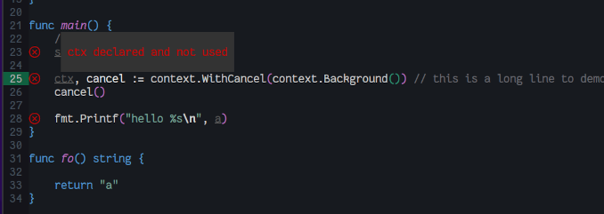

lsp-bridge-term - lsp-bridge terminal support for Emacs
---
This package provides a subset of LSP implementations for terminal environment based on [lsp-bridge](https://github.com/manateelazycat/lsp-bridge). It was coded in a simple streight way. For better coding experience, use *lsp-bridge* in GUI environment instead.

# Features
Support display popup in terminal.
- Code completion
- Code action
- Documentation
- Signature
- Diagnostics

# Installation
## prerequisite
### lsp-bridge
Install [lsp-bridge](https://github.com/manateelazycat/lsp-bridge) and make sure it works on your machine before trying this package.

### emacs-popon
This package uses `emacs-popon` to display popup with `overlay` in terminal.
`emacs-popon` is not in `elpa/melpa` repository, you need to clone repository from _codeberg_.
```shell
git clone https://codeberg.org/akib/emacs-popon.git
```
and then add  to `load-path`.

### nerd-font
Download and install nerd fonts, and configure terminal to use one of nerd mono fonts.

## init script
### use-package
Add following configuration when use `use-package`.
```lisp
(unless (display-graphic-p)
  (use-package popon)
  (use-package lsp-bridge-term
    :init
    (add-hook
     'emacs-startup-hook
     (lambda ()
       (with-eval-after-load 'acm (require 'lsp-bridge-term))))))
```
# Keymap
Default key bindings for `lsp-bridge-term` minor mode, works when popup is present.

| Key   | Command                     | Description                                             |
|-------|-----------------------------|---------------------------------------------------------|
| M-n   | lsp-bridge-term-select-next | highlight next candidate in menu or scroll doc up       |
| Down  | lsp-bridge-term-select-next | same as C-n                                             |
| M-p   | lsp-bridge-term-select-prev | highlight previous candidate in menu or scroll doc down |
| Up    | lsp-bridge-term-select-prev | same as C-p                                             |
| C-m   | lsp-bridge-term-complete    | select current highlighted menu or close doc            |
| Enter | lsp-bridge-term-complete    | same as C-m                                             |
| C-g   | lsp-bridge-term-cancel      | cancel any popup if present                             |

Global key bindings.
| key     | Command                                 | Description                                  |
|---------|-----------------------------------------|----------------------------------------------|
| C-c C-n | lsp-bridge-term-next-error              | goto next error if present                   |
| C-c C-p | lsp-bridge-term-prev-error              | goto previous error if present               |
| C-c C-d | lsp-bridge-term-show-diagnistic-message | show diagnostic message at cursor if prenset |

Use `lsp-bridge` key bindings to popup `documentation` and `code action`.
# Command
- `lsp-bridge-term-diagnostics-inline-toggle` toggle diagnostic message overlays.

# Options
- `lsp-bridge-term-menu-items-max` default `25`, maximum menu items to display in popup. When menu has more items than this,  use scroll to see all.
- `lsp-bridge-term-doc-line-max` default `75`, maximum line length to display doc popup. Documentation line longer than this value will be splited into multiple lines.
- `lsp-bridge-term-doc-line-min` default `45`, minimum line length to display doc popup. When `window` space is insufficient, open doc in `other window`.
- `lsp-bridge-term-popup-min-height` default `5`, minimum height to display popup. When `window` space is insufficient, open doc in `other window`.
- `lsp-bridge-term-popup-max-height` default `25`, maximum height to display popup. When displaying content is more than this, popup only display portion of content with this height, use `C-n` to scroll popup to see hiding content.
- `lsp-bridge-term-diagnostics-inline` default `nil`, when `t`, display diagnostic messages in `overlay`s. Use `lsp-bridge-term-diagnostics-inline-toggle` function to toggle on/off.
- `lsp-bridge-term-popup-wait-time` default `0.1` (100ms), wait idle time in seconds to popup.

# Customization
Customization not supported yet, which means nerd font icons, faces and etc are *hardcoded*, helps requires.

# Known issues and TODOs
This package simply overrides `lsp-bridge-` functions to handle LSP messages from python end, instead of implementing `acm`.
- Features supported by `acm` may be missing in terminal environment
- Performance may degrade in terminal environment
- ~~Without `timer`, `cache` and display popup directly when receiving LSP message brings *input lag*~~
- Varies backend not supported.

# Screenshots
Code Completion


Code Action


Signature


Documentation


Diagnostics Indicator


Diagnostics Message


Diagnostic message popup


